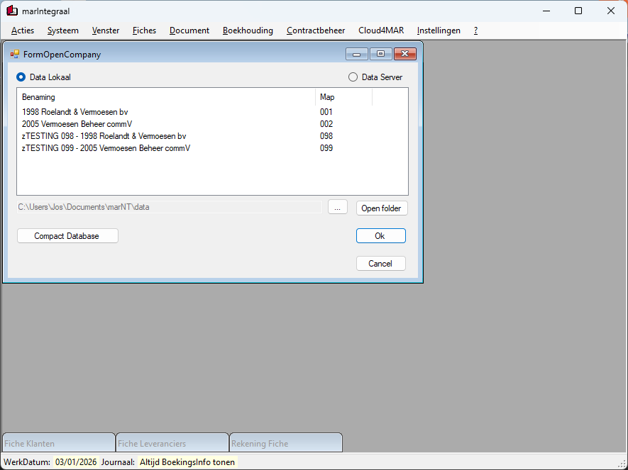

# marIntegraal

## [ClickOnce][ClickOnce]

## History

marIntegraal stands for: complete bookkeeping around the Minimum Classification General Accounting System (Belgium).

- It is a project that was first marketed for Amstrad/Schneider PCW on CP/M PLUS at the end of 1985. At that time the program was written in Mallard BASIC, one of the few fast BASIC versions that uses B-Plus tree index sorting on CP/M and MS-DOS/PC-DOS.
- This version of our program is converted from VB6 to .NET  C# 7.3 and is Open-Source. The commercialized version is available on our website vsoft.be (All our customers since 1985 can enjoy the development from then until now and ask questions.)
- The program is designed to be used by small and medium-sized enterprises that want to keep their bookkeeping in accordance with Belgian regulations.
- The program is modular, allowing users to choose the features they need. The main modules include general accounting, accounts receivable and payable, VAT reporting, and financial reporting.
- The program supports multiple users and can be used in a network environment.
- From 2026, we will serve our customers 100% by delivering programs 'as a service'. This means that the programs will be hosted on our servers and accessed via ClickOnce technology. This approach ensures that customers always have access to the latest version of the software without the need for manual updates or installations.
- The program is regularly updated to comply with changes in Belgian accounting regulations and to add new features based on user feedback.
- At the moment (january 2026), in this Open Source version, we are having fun translating and testing the reporting functions from the commercial version. You can freely view our work in progress if you wish
- This latest version of our open source program is written in C# 7.3 using .NET Framework 4.8 with an MS Access database backend. With lot of help from GitHub Copilot Chat, we are converting the VB6 code to C# code step by step.
- Have fun!

[ClickOnce]: https://clickonce.vsoft.be/Mar2026/publish.htm
